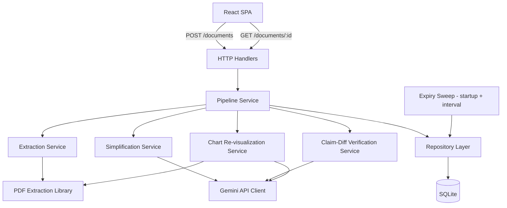
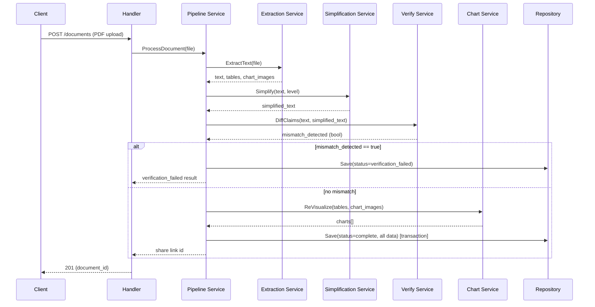

# Blueprint Document

Blueprint Version: 1.0
Project Name: PaperViz
Architecture Style: Monolith, single binary
System Scope: PDF/text ingestion, LLM-based simplification, chart re-visualization, ephemeral link publishing

---

## 1. Context Lock

- Runtime: Go 1.25+ (backend), Node 24+ (frontend build only, not runtime)
- Database: SQLite via `modernc.org/sqlite` (no CGO)
- ORM: NOT_ALLOWED. Raw SQL with `database/sql` REQUIRED.
- Router: `chi`
- Frontend: React + Vite + Tailwind CSS + shadcn/ui, single-page app, static build served by Go binary
- Charting: Recharts (frontend only)
- LLM Provider: Google Gemini API, direct HTTP integration. NOT_ALLOWED to route through any internal gateway in MVP.
- PDF text/image extraction: Go-native library (e.g. `ledongthuc/pdf` or `pdfcpu`) for text; `pdfcpu` or equivalent for image extraction. EXACT_VERSION to be pinned in `go.mod` at implementation time — no floating versions.
- Allowed Libraries: `chi`, `modernc.org/sqlite`, one PDF text-extraction library, one PDF image-extraction library, standard library `net/http`, `encoding/json`.
- Forbidden Libraries: any ORM (gorm, ent, sqlx-as-ORM-substitute), any CGO-dependent SQLite driver, any microservice/RPC framework (gRPC NOT_ALLOWED for MVP — single binary only).
- Dependency Direction: `handlers → services → repository → database`. STRICT. No layer MUST import a layer below violating this direction. Repository MUST NOT import services or handlers.

---

## 2. Architectural Boundaries

- Layers: `handlers` (HTTP request/response only), `services` (business logic: simplification orchestration, verification, chart pipeline), `repository` (SQLite access), `external` (Gemini API client, PDF extraction wrappers).
- Allowed Call Flow: `handlers → services`, `services → repository`, `services → external`.
- Forbidden Call Flow: `handlers → repository` (MUST go through services). `repository → external` (PROHIBITED — repository is data-only). `external → repository` (PROHIBITED).
- Cross-layer Rules: Services MUST NOT contain `net/http` types (no `http.Request`/`http.ResponseWriter` leakage below handlers). Repository MUST NOT contain business logic (no conditional branching on document content — only CRUD operations parameterized by caller).

---

## 3. Data Model Contract

- Normalization Level: 3NF.
- Table Definitions:

```sql
CREATE TABLE documents (
    id TEXT PRIMARY KEY,           -- nanoid, non-guessable
    created_at INTEGER NOT NULL,   -- unix timestamp
    last_accessed_at INTEGER NOT NULL,
    status TEXT NOT NULL,          -- 'processing' | 'complete' | 'failed' | 'verification_failed'
    source_type TEXT NOT NULL,     -- 'pdf' | 'pasted_text'
    reading_level TEXT NOT NULL,   -- 'simplified' | 'eli5'
    original_text TEXT NOT NULL,
    simplified_text TEXT,
    error_message TEXT
);

CREATE TABLE charts (
    id TEXT PRIMARY KEY,
    document_id TEXT NOT NULL REFERENCES documents(id) ON DELETE CASCADE,
    source_method TEXT NOT NULL,   -- 'data_extracted' | 'image_fallback' | 'omitted'
    chart_data TEXT,               -- JSON, null if image_fallback or omitted
    image_blob BLOB,               -- null if data_extracted
    annotation TEXT,               -- plain-language explanation
    page_number INTEGER,
    display_order INTEGER NOT NULL
);

CREATE TABLE claim_diffs (
    id TEXT PRIMARY KEY,
    document_id TEXT NOT NULL REFERENCES documents(id) ON DELETE CASCADE,
    original_claims TEXT NOT NULL,   -- JSON array
    simplified_claims TEXT NOT NULL, -- JSON array
    mismatch_detected INTEGER NOT NULL, -- 0 or 1
    mismatch_detail TEXT
);
```

- Index Policy: `documents.last_accessed_at` MUST be indexed (used by expiry sweep). `charts.document_id` and `claim_diffs.document_id` MUST be indexed (foreign key lookups).
- Constraint Policy: `documents.status` MUST be constrained via `CHECK` to the 4 listed enum values. `charts.source_method` MUST be constrained via `CHECK` to the 3 listed enum values.
- Denormalization Policy: PROHIBITED for MVP. No denormalized read-optimized tables — volume does not justify it.

---

## 4. Execution Constraints

- Async Policy: Document processing (extraction → simplification → verification → chart pipeline) MUST run as a single synchronous request-scoped goroutine chain per document, NOT a background job queue. Justification: solo-dev low-volume MVP; a job queue is premature infrastructure. Client polls a status endpoint.
- Transaction Policy: Each document's full write (document row + chart rows + claim_diff row) MUST occur within a single SQLite transaction. Partial writes on failure are PROHIBITED — failed jobs MUST roll back to a clean `failed` status row only.
- Logging Policy: Structured JSON logging REQUIRED for all external API calls (Gemini, PDF extraction) including latency and success/failure. STRICT: no logging of full document text content (privacy/log-volume hygiene) — log document ID and byte length only.
- Error Handling Policy: All external calls (Gemini API, PDF parsing) MUST have explicit timeout (MAX_LIMIT: 30s per Gemini call, 10s per PDF parse operation). Retry policy: Gemini calls retry MAX_LIMIT 1 time on failure. PDF parse failures MUST NOT retry (deterministic failure, retry is wasted work).
- Validation Policy: Uploaded PDF MUST be validated for: file size (MAX_LIMIT 20MB), MIME type (`application/pdf` only), presence of extractable text layer (reject before any LLM call if absent).

---

## 5. Integration Contracts

- Module Rules: `services/pipeline.go` MUST orchestrate the full flow (extract → simplify → verify → chart) as an explicit sequential function. STRICT: no hidden side effects in extraction/simplification functions — each MUST be a pure function of (input) → (output, error).
- File Rules: Uploaded PDFs MUST NOT be persisted to disk beyond request lifetime. Extraction happens in-memory; only extracted text/data is persisted to SQLite. PROHIBITED: writing uploaded PDF bytes to any file path.
- External Service Rules: Gemini API key MUST be loaded from environment variable only. PROHIBITED: hardcoded keys, keys in config files committed to repo.
- Security Rules: Document IDs MUST be generated via cryptographically random nanoid (MIN 12 characters). Sequential/incrementing IDs are PROHIBITED (enumeration risk). No authentication layer exists — MUST NOT be added speculatively; access control is link-possession-only by design.

---

## 6. Verification Rules

**Acceptance Scenarios:**
1. Valid text-based PDF uploaded → document processed → share link returned → link resolves to rendered simplified text + charts (if any extracted).
2. Pasted text input (no PDF) → same pipeline, `source_type = 'pasted_text'`, chart pipeline skipped (no table/figure data available from plain text — chart pipeline REQUIRES source PDF).
3. Claim-diff check detects no mismatch → document status `complete`.
4. Claim-diff check detects mismatch → document status `verification_failed`, result page shows explicit warning banner, does NOT silently serve unverified simplified text as if verified.
5. Link accessed after 7 days of inactivity → 404, resource treated as deleted.

**Failure Scenarios:**
1. PDF has no text layer (scanned image) → reject at upload, explicit error, no LLM call made.
2. Gemini API call times out after retry → document status `failed`, error_message populated, partial data NOT published.
3. Chart data-extraction fails for a given chart → fallback to image extraction for that specific chart only; other charts in the same document proceed independently.
4. Both chart extraction methods fail for a given chart → chart entry with `source_method = 'omitted'`, inline note shown, rest of document unaffected.

**Non-goals (architectural):**
- No job queue / worker pool. No message broker. No microservices.
- No user authentication subsystem.
- No horizontal scaling design — single instance is the design target.
- No caching layer (Redis/Valkey) — SQLite read latency is sufficient at target volume.

**Out-of-Scope:**
- Interactive chart rendering (client-side parameter manipulation) — explicitly excluded from this blueprint; would require a computable-model extraction subsystem not designed here.
- OCR for scanned PDFs.
- Multi-tenant data isolation (no tenants exist in this design).

---

## A. Architecture Diagram



---

## B. Component Responsibility Matrix

| Component | Responsibility | Scenario Supported |
|---|---|---|
| HTTP Handlers | Parse request, validate input shape, call Pipeline Service, serialize response | Acceptance 1, 2 |
| Pipeline Service | Orchestrate extract→simplify→verify→chart sequentially, manage transaction | Acceptance 1–4 |
| Extraction Service | Extract text + tabular data + chart images from PDF | Acceptance 1, Failure 1 |
| Simplification Service | Call Gemini to rewrite text at target reading level | Acceptance 1, 2 |
| Claim-Diff Verification Service | Extract claims from original + simplified text, compare, flag mismatch | Acceptance 3, 4 |
| Chart Re-visualization Service | Attempt data-based chart reconstruction, fall back to image+annotation | Failure 3, 4 |
| Repository Layer | CRUD for documents/charts/claim_diffs, expiry queries | All scenarios (persistence) |
| Expiry Sweep | Periodic deletion of documents past 7-day inactivity | Acceptance 5 |

---

## C. Data Contracts

**Entities**: `Document` (1) — (0..N) `Chart`; `Document` (1) — (1) `ClaimDiff`.
**Ownership boundary**: `Document` is the aggregate root. `Chart` and `ClaimDiff` rows are deleted via `ON DELETE CASCADE` when their parent `Document` is deleted — no orphaned rows permitted.
**Required fields**: see Section 3 table definitions — all `NOT NULL` columns are required at write time; no nullable-by-default columns beyond those explicitly marked nullable (`simplified_text`, `error_message`, `chart_data`, `image_blob`, `annotation`, `page_number`).

---

## D. End-to-End Dry Run



---

## E. Internal Contracts

**API Contract — Create Document**
```json
POST /api/documents
Content-Type: multipart/form-data
{
  "file": "<binary, optional>",
  "text": "<string, optional — exactly one of file/text REQUIRED>",
  "reading_level": "simplified | eli5"
}

201 Response:
{ "document_id": "V1StGXR8_Z5jdHi6B", "status": "processing" }

4xx Response:
{ "error": "no_text_layer | invalid_reading_level | file_too_large | missing_input" }
```

**API Contract — Get Document**
```json
GET /api/documents/:id

200 Response:
{
  "id": "V1StGXR8_Z5jdHi6B",
  "status": "complete | processing | failed | verification_failed",
  "reading_level": "simplified",
  "simplified_text": "...",
  "original_text": "...",
  "charts": [
    { "id": "...", "source_method": "data_extracted", "chart_data": {...}, "annotation": "..." }
  ],
  "error_message": null
}

404: document not found or expired.
```

**Error Contract**: All error responses use `{ "error": "<snake_case_code>" }`. STRICT: no raw error strings/stack traces exposed to client.

**Retry/Timeout Policy**: See Section 4, Error Handling Policy. Client polling interval for `processing` status: REQUIRED minimum 2s between polls (frontend-enforced).

**Logging Contract**: Every pipeline stage MUST log `{stage, document_id, duration_ms, success}` as structured JSON to stdout.

**Testing Contract**: Every service function MUST have a table-driven unit test covering at minimum: 1 success case, 1 error case. Pipeline-level integration test REQUIRED covering all 4 acceptance scenarios in Section 6.

**Versioning Contract**: API is unversioned for MVP (`/api/documents`, not `/api/v1/documents`) — single client, no external consumers, versioning is premature.
