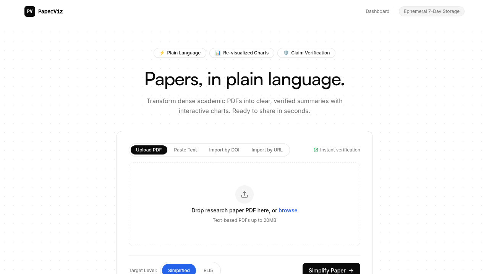
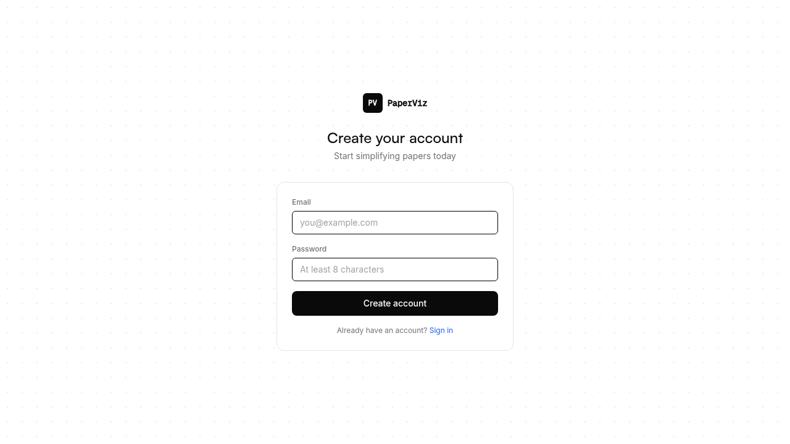
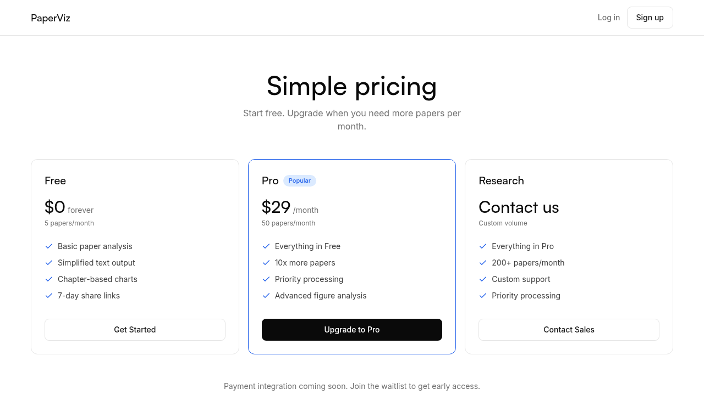
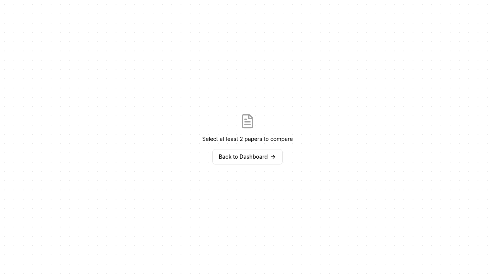
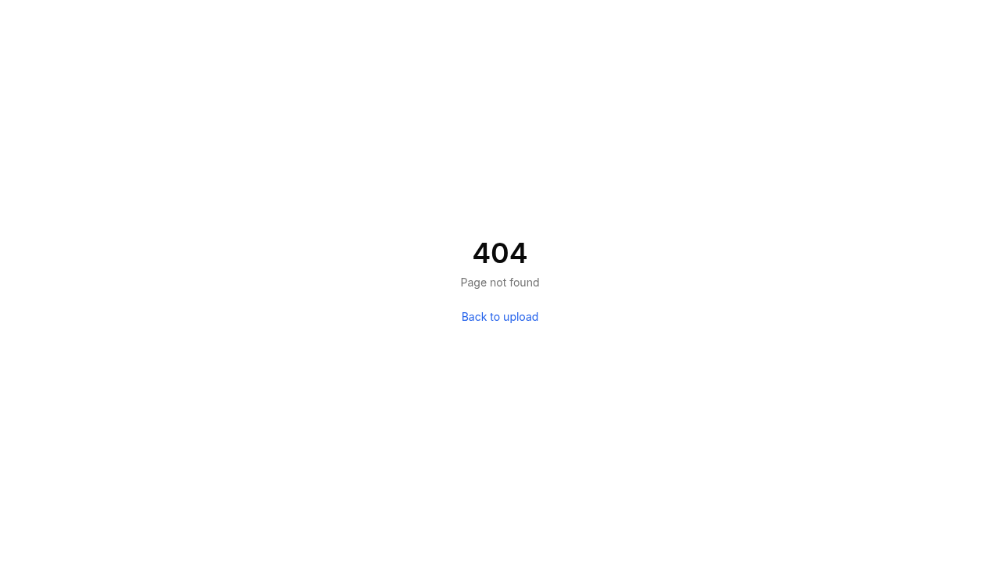

# PaperViz

Upload a PDF. Get a plain-language summary with re-visualized charts.

---

## Screenshots

| Landing | Login | Signup |
|:---:|:---:|:---:|
|  |  |  |

| Pricing | Compare | Dashboard |
|:---:|:---:|:---:|
|  |  |  |

| 404 | Navigation |
|:---:|:---:|
|  |  |

---

## Quick Start

```bash
# Prerequisites: Go 1.22+, Node.js 18+, npm 9+
# Get a Gemini API key: https://aistudio.google.com/apikey

# 1. Configure
cp .env.example .env
# Edit .env — set GEMINI_API_KEY=your-key

# 2. Install deps
go mod tidy
cd frontend && npm install && cd ..

# 3. Run (two terminals)
# Terminal 1 — backend:
export $(grep -v '^#' .env | xargs) && go run ./cmd/server
# Terminal 2 — frontend dev server:
cd frontend && npm run dev
```

Open `http://localhost:5173`.

## Build & Run (production)

```bash
make build    # builds frontend + Go binary
make run      # runs ./server with .env vars
```

Single binary serves API + built frontend on port 8080 (set via `PORT` in `.env`).

## How It Works

1. Upload a PDF (text-layer only, no OCR) or paste text
2. Backend extracts text + chart images
3. Gemini simplifies content to chosen reading level (ELI5 / Simplified), then verifies claims against the original
4. Simplified text is split into chapters; charts are re-generated per chapter (or re-rendered from captured images)
5. Shareable link expires after 7 days of inactivity

## Tech Stack

- **Backend:** Go 1.22+, chi router, modernc.org/sqlite (pure Go, no CGO)
- **Frontend:** React 18, Vite, Tailwind CSS, Recharts
- **LLM:** Google Gemini API (direct HTTP, no SDK)
- **PDF:** pdfcpu + ledongthuc/pdf (in-memory, no disk writes)

## Deployment

Single Go binary + SQLite. No Docker required, but container-friendly.

| Platform | Notes |
|---|---|
| **Railway** / **Fly.io** | Container-native, easy DB volume setup |
| **Render** | Deploy from Git, supports Go natively |
| **VPS** (DigitalOcean, etc.) | Run the binary directly |

All require `GEMINI_API_KEY` set as an environment variable.

## Documentation

| File | What it covers |
|---|---|
| `INSTALLATION_AND_SETUP.md` | Detailed setup, caveats, project structure |
| `docs/architecture.md` | Design decisions, layers, data flow |
| `docs/PRD.md` | Product requirements, acceptance scenarios |
| `DESIGN.md` | Design system, tokens, components |
| `docs/PLAN.md` | Phase tracking, implementation checklist |
| `AGENTS.md` | Agent rules, known issues |

## License

MIT
