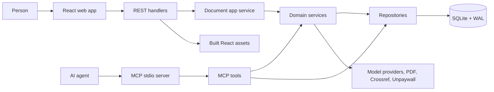

# PaperViz

PaperViz turns academic papers into simplified explanations, verified claims, and evidence-grounded figures. It is designed for AI agents that need structured research data, with a web app for account management and manual paper upload.

PaperViz runs on infrastructure and credentials it owns, and nothing else. There is no Google OAuth account, no Stripe account, and no model vendor account: users bring their own model key, which is encrypted at rest. Model spend belongs to the user, so the service is free to run without metering anyone's wallet.

> **Current architecture note:** the web ingestion path runs the full LLM-backed processing pipeline using the requesting user's own model key. The repository's MCP server currently exposes five deterministic data tools over stdio; its `ingest_document` tool stores text but does not start the LLM pipeline. See [Current limitations](#current-limitations) before relying on the agent workflow.

## Product Surfaces

### Agent interface

The local MCP server exposes five tools:

| Tool | Purpose |
|---|---|
| `ingest_document` | Validate and store pasted paper text |
| `search_documents` | Search stored documents by title |
| `get_document` | Retrieve metadata and selected research sections |
| `get_figures` | Retrieve chart data, source locations, and provenance |
| `get_evidence` | Retrieve evidence and linked claims |

MCP and REST share the same SQLite database when configured with the same `DATABASE_PATH`. The local MCP server reads the model key from its own environment and calls the provider directly, so no credential passes through this service.

### Web interface

The React application supports:

- PDF, pasted-text, DOI, and URL ingestion
- Simplified and ELI5 reading levels
- Asynchronous processing with visible stage updates
- Simplified explanations and claim verification
- Evidence-grounded chart generation
- Claims, evidence, methods, results, tables, and citations
- Authentication, model key management, collections, annotations, and exports
- Ephemeral document and figure sharing

## Trust Model

PaperViz separates evidence extraction from AI interpretation:

1. Deterministic code extracts numeric evidence and table data from paper text.
2. Deterministic code groups evidence into candidate datasets.
3. The model may choose chart type, title, and explanation.
4. The model may not invent chart values.
5. A deterministic grounding validator rejects unsupported data before rendering.
6. Simplified claims are compared with original claims; detected mismatches remain visible as evidence.

Core principle: **AI may transform evidence, but it must never manufacture evidence.**

## Architecture



Dependency direction:

```text
Web UI → REST handlers → app/domain services → repositories → SQLite
MCP client → MCP tools → app/domain services and repositories
Domain services → external providers
```

The production runtime is one Go binary serving both API routes and built frontend assets. The MCP process is a separate stdio entrypoint and can share the same database file.

## Technology

| Area | Technology |
|---|---|
| Backend | Go 1.25, `chi`, raw `database/sql` |
| Database | SQLite through `modernc.org/sqlite`, WAL enabled, no CGO |
| Frontend | React 19, Vite 8, Tailwind CSS 4, shadcn/ui, Recharts |
| Agent interface | Model Context Protocol over stdio |
| LLM | Provider-agnostic HTTP client, one backend per vendor, key supplied per request (BYOK) |
| PDF | `pdfcpu` and `ledongthuc/pdf`, processed in memory |
| Validation | Go tests, frontend lint/build, Playwright E2E |

## Quick Start

### Prerequisites

- Go 1.25
- Node.js 24
- npm

No vendor account is needed. The one secret the server needs is
`CREDENTIAL_ENCRYPTION_KEY`, which you generate yourself:

```bash
openssl rand -base64 32
```

Users supply their own model key in the web UI. A Gemini key in your
environment is only needed to run the local MCP server, which calls the
provider directly from your machine.

The server validates required environment variables at startup. See
[`docs/getting-started.md`](docs/getting-started.md) for variable-by-variable setup.

### 1. Configure

```bash
cp .env.example .env
```

Edit `.env`. At minimum, provide non-empty values for every variable marked required in that file.

### 2. Install dependencies

```bash
go mod download
npm --prefix frontend ci
```

### 3. Start backend

PaperViz does not load `.env` inside the Go process. Export it before starting the server:

```bash
set -a
source .env
set +a
go run ./cmd/server
```

Verify backend health:

```bash
curl http://localhost:8080/healthz
```

Expected response:

```json
{"status":"ok"}
```

### 4. Start frontend

In a second terminal:

```bash
npm --prefix frontend run dev
```

Open `http://localhost:5173`.

Vite proxies `/api` requests to the backend port configured by `PORT`.

## Build and Run

```bash
make build
make run
```

`make build` installs frontend dependencies when needed, creates `frontend/dist`, and builds `./server`. `make run` rebuilds and starts that binary with variables exported from `.env`.

For explicit builds:

```bash
npm --prefix frontend run build
CGO_ENABLED=0 go build -o server ./cmd/server
```

## Repository Map

```text
paperviz/
├── cmd/
│   ├── server/              # HTTP application entrypoint
│   ├── mcp/                 # stdio MCP entrypoint
│   └── admin/               # account recovery CLI
├── internal/
│   ├── app/documents/       # document application service and read model
│   ├── app/credentials/     # resolves a user's stored key into a model client
│   ├── handlers/            # REST transport, middleware, auth, credentials
│   ├── services/            # pipeline and domain logic
│   ├── repository/          # raw SQLite repositories and migrations
│   ├── external/            # model provider clients, PDF, DOI, URL
│   ├── mcp/                 # MCP tools, schemas, limits, and errors
│   ├── models/              # shared chart and research value types
│   ├── apperr/              # shared application errors
│   └── infra/               # infrastructure helpers
├── migrations/              # 21 ordered SQL migrations
├── frontend/                # React SPA
├── e2e/                     # Playwright tests
├── docs/                    # Product, architecture, operations, and API docs
├── DESIGN.md                # UI source of truth
└── AGENTS.md                # repository rules and known engineering context
```

## Documentation

Start with [`docs/README.md`](docs/README.md) for reading paths and source-of-truth rules.

| Goal | Read |
|---|---|
| Understand product and trust model | [`docs/overview.md`](docs/overview.md) |
| Run locally and analyze a paper | [`docs/getting-started.md`](docs/getting-started.md) |
| Change, test, or debug the system | [`docs/maintainer-guide.md`](docs/maintainer-guide.md) |
| Look up routes, files, config, and commands | [`docs/codebase-reference.md`](docs/codebase-reference.md) |
| Understand architecture constraints | [`docs/ARCHITECTURE.md`](docs/ARCHITECTURE.md) |
| Understand paper processing | [`docs/DATA_PIPELINE.md`](docs/DATA_PIPELINE.md) |
| Use REST API | [`docs/structured-research-api.md`](docs/structured-research-api.md) and [`docs/openapi.yaml`](docs/openapi.yaml) |
| Understand MCP scope | [`docs/mcp-parity.md`](docs/mcp-parity.md) |
| Review current engineering state | [`docs/PROJECT_STATE.md`](docs/PROJECT_STATE.md) |

## Current Limitations

- Scanned-image PDFs are not supported; input PDFs need a text layer.
- `ingest_document` performs deterministic text intake only. It does not invoke a model, start the web processing pipeline, or wait for simplified output.
- Analysing a paper requires an account with a model key configured. Because the server holds no model credential of its own, there is no anonymous or free-tier path to a processed document: uploads without a usable key fail with `missing_credential`.
- Only the Gemini backend is implemented. `anthropic` and `openai` are accepted by the credential API and stored, but resolving one fails until their backends land.
- Service API keys are returned exactly once, at issue time, and stored only as a SHA-256 digest. A lost key cannot be recovered, only replaced.
- There is no self-service password reset. Use `go run ./cmd/admin reset-password <email>`, which also revokes that account's live sessions.
- `/agents` currently generates remote MCP configuration for `https://paperviz.com/api/mcp`, but the current server router does not expose that HTTP MCP transport. The repository ships a local stdio MCP entrypoint.
- MCP search is global and stateless; it is not scoped to an authenticated user's library.
- SQLite uses one open connection, and the architecture is designed for a single low-concurrency instance rather than horizontal scaling.
- Some public static SEO pages and screenshot assets predate the current route cuts. Product navigation follows `frontend/src/App.jsx`, not those artifacts.

## Contributing Rules

Before changing code, read [`AGENTS.md`](AGENTS.md). Before changing UI, read [`DESIGN.md`](DESIGN.md) completely. Keep documentation synchronized with behavior when routes, tools, environment variables, or architecture boundaries change.
