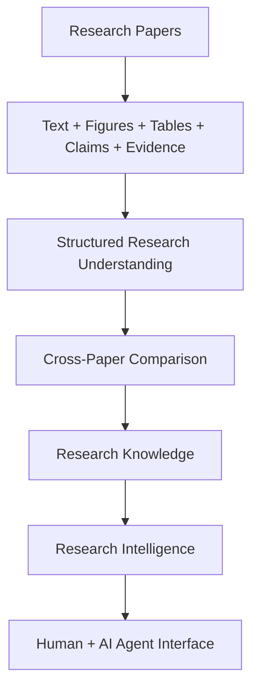
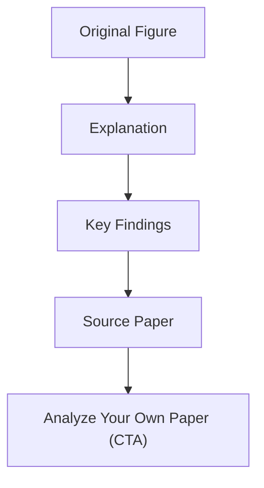
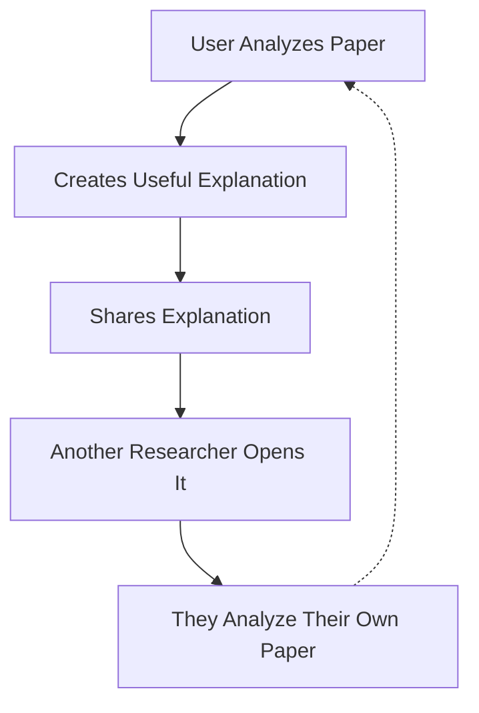
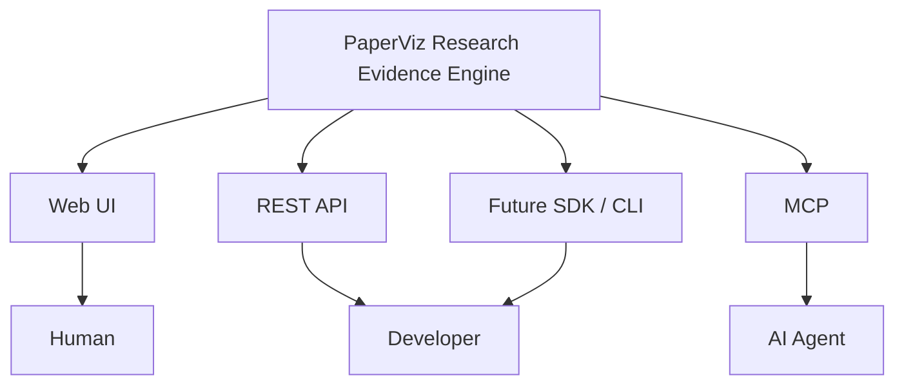
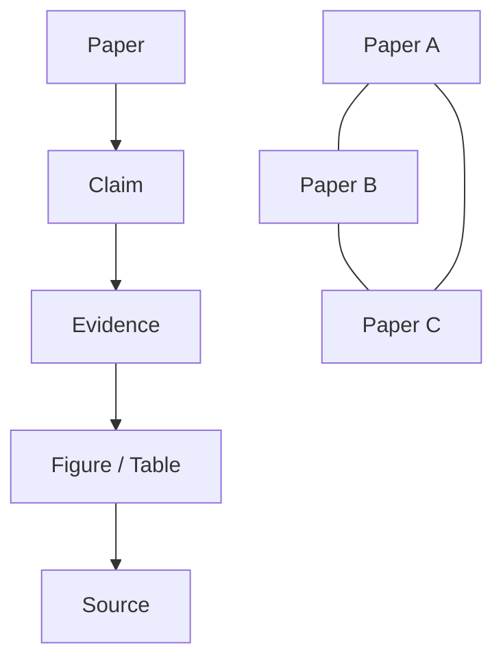
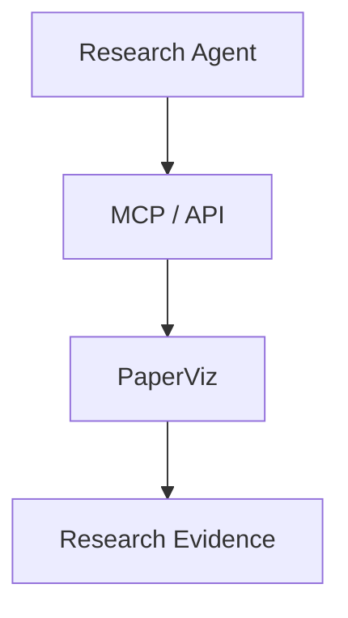
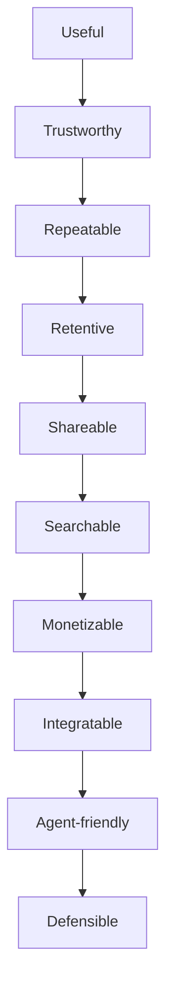

# PaperViz — Agent Roadmap

**Repo:** https://github.com/RizkiRdm/paperviz
**Mission:** Turn PaperViz from a generic AI PDF summarizer into a durable AI Research Evidence Understanding Platform.

---

## 0. How To Use This Document (Read First)

1. Everything in **Section 2 (Global Rules)** is always-on. Apply it to every chunk, every response, no exceptions.
2. Do **not** run ahead and execute the whole roadmap. Work on exactly one chunk at a time — wait until the user names a chunk ID (e.g. "do chunk 1.1").
3. Before touching code: inspect the relevant files in the repo first (Rule 1). Don't assume the repo matches this doc.
4. Implement only what the named chunk asks for. Smallest change that satisfies it (Rule 2).
5. When finished, reply using the **Report Template** in Section 5 — nothing more, nothing less.

**Session setup:** paste Sections 1–5 once at the start of a session/project (positioning + global rules + priority matrix + definition of done + report template). Then, per task, paste just the one chunk block from Section 7.

---

## 1. Product Positioning

Do **not** position PaperViz as:
- Generic AI PDF summarizer
- "Chat with PDF"
- Generic AI research assistant
- Another ChatGPT wrapper

**Target positioning:**
> PaperViz helps researchers understand complex research papers by turning dense text, figures, and results into clear, evidence-linked explanations.

**Long-term direction:**



---

## 2. Global Rules (Always Apply)

**Rule 1 — Inspect Before Editing**
Read the relevant files and understand current routes, services, models, and schema before changing anything. Don't assume the repo matches this doc.

**Rule 2 — Minimal Changes**
Ship the smallest change that satisfies the task. No unrelated rewrites, no new frameworks, no microservices, no Redis/Postgres/vector DB without proven need, no AI features added just because they sound impressive.

**Rule 3 — Product Before Engineering**
Every feature must justify itself through activation, understanding, retention, monetization, distribution, integration, or defensibility. If it doesn't move one of those, don't prioritize it.

**Rule 4 — Preserve Research Integrity**
Never alter the meaning of the source paper. Explanations must carry page number, figure/table number, source text, provenance, and uncertainty. Generated visuals are derived representations, not replacements for the original evidence.

**Rule 5 — Don't Overbuild**
No enterprise billing, complex org management, advanced permissions, multi-model infra, marketplace, agent ecosystem, large vector DB, or distributed/Kubernetes/event-driven architecture. Those belong to later phases.

**Rule 6 — Validate Assumptions**
When implementation depends on something uncertain: state the assumption, explain why it matters, and prefer the smallest implementation that can validate it.

**Rule 7 — No Fake Completion**
Don't call a feature "done" unless it's implemented, tests pass, the build passes, edge cases are considered, and existing functionality still works.

**Rule 8 — Keep Architecture Pragmatic**
Current stack: Go backend, SQLite, React/Vite frontend, Gemini API, PDF processing libs, single-binary deployment. Keep it unless a real requirement forces a change.

---

## 3. Priority Matrix

| Priority | Items |
|---|---|
| **P0 — Critical** | Repo audit · Evidence provenance · Figure explanation quality · Original vs explained figure · Research-oriented summary · Activation measurement · Paper history · Save/reopen workflow |
| **P1 — High** | Multi-paper comparison · Evidence comparison · Shareable figure explanations · Shareable paper explanations · SEO foundation · Usage analytics · Cost measurement |
| **P2 — Medium** | Monetization · API · OpenAPI · Canonical research output contract · MCP · Research collections · DOI/URL import · Zotero integration · Browser extension |
| **P3 — Later** | SDKs · Research knowledge graph · Agent ecosystem · Team collaboration · Advanced integrations |
| **P4 — Do Not Build Yet** | Kubernetes · microservices · complex vector DB · enterprise SSO · complicated permissions · multi-model orchestration · AI marketplace · generic AI chatbot features · gamification · excessive dashboards · dozens of integrations · unnecessary feature variants |

---

## 4. Definition of Done

A chunk is complete only when:

- [ ] Relevant code was inspected
- [ ] Implementation is complete
- [ ] Existing functionality remains intact
- [ ] Tests added/updated where appropriate
- [ ] Build succeeds
- [ ] Lint/type checks pass where applicable
- [ ] Error states are handled
- [ ] Security/privacy implications considered
- [ ] Docs updated if architecture/behavior changed
- [ ] You reported exactly what changed (Section 5 template)

---

## 5. Report Template (use after every chunk)

```
## Completed
- Files changed:
- Features implemented:
- Tests added:
- Key decisions:

## Validation
- Build status:
- Test status:
- Lint status:
- Manual validation performed:

## Risks
- Known limitations:
- Assumptions:
- Unresolved issues:

## Next Chunk
- Recommended: [chunk ID]
```

---

## 6. Chunk Index

> **Completed:** Phases 1–3 (Trust & Core Value, Activation & Retention, Multi-Paper Intelligence) are intentionally omitted from this active roadmap. Their outcomes are treated as prerequisites for the remaining phases.
>
> **Current roadmap:** Phase 4 onward. Phase numbers are preserved to avoid breaking existing references.

| Phase | Chunk | Title |
|---|---|---|
| 4 — Product-Led Distribution | 4.1 | Shareable Figure Explanation |
| 4 — Product-Led Distribution | 4.2 | Shareable Paper Explanation |
| 4 — Product-Led Distribution | 4.3 | Product-Led Referral Loop |
| 5 — SEO Foundation | 5.1 | SEO Architecture |
| 5 — SEO Foundation | 5.2 | Product Pages |
| 5 — SEO Foundation | 5.3 | Programmatic SEO |
| 6 — Monetization | 6.1 | Usage Measurement |
| 6 — Monetization | 6.2 | Usage Limits |
| 6 — Monetization | 6.3 | Cost Model |
| 6 — Monetization | 6.4 | Pricing & Packaging Experiment |
| 7 — API & Agent Readiness | 7.1 | Structured Research API |
| 7 — API & Agent Readiness | 7.2 | Canonical Research Output Contract |
| 7 — API & Agent Readiness | 7.3 | OpenAPI |
| 7 — API & Agent Readiness | 7.4 | MCP |
| 7 — API & Agent Readiness | 7.5 | Human/Agent Capability Parity |
| 7 — API & Agent Readiness | 7.6 | MCP Usage, Security & Cost Controls |
| 8 — Research Knowledge Layer | 8.1 | Structured Research Objects |
| 8 — Research Knowledge Layer | 8.2 | Evidence Graph |
| 8 — Research Knowledge Layer | 8.3 | Cross-Paper Research Map |
| 9 — Growth & Ecosystem | 9.1 | Integrations |
| 9 — Growth & Ecosystem | 9.2 | Developer SDKs |
| 9 — Growth & Ecosystem | 9.3 | Agent Ecosystem |
| 10 — Defensibility | 10.1 | Research Knowledge Accumulation |
| 10 — Defensibility | 10.2 | Workflow Lock-In |
| 11 — AI Resilience | — | Continuous resilience check |
| 12 — Cleanup | 12.1 | Product Cleanup |

---

## 7. Active Chunks

### PHASE 4 — Product-Led Distribution
No paid ads. Build distribution into the product itself.

#### Chunk 4.1 — Shareable Figure Explanation
**Goal:** Public share pages for individual figures.



**Do:** Unique public URL, privacy controls, expiration support where appropriate, clear source attribution, CTA to analyze another paper.
**Constraints:** The original figure and PaperViz interpretation must remain clearly distinguishable. Shared content must preserve provenance and uncertainty. Do not expose private uploads by default.

#### Chunk 4.2 — Shareable Paper Explanation
**Do:** Support public / unlisted / private visibility.
**Constraints:** No complicated permission system. Shared pages must remain useful without signup while respecting document ownership and visibility.

#### Chunk 4.3 — Product-Led Referral Loop


**Constraints:** The share page must be useful even without signup. No aggressive referral mechanics.
**Success signal:** Measure share → visit → analysis conversion, not raw share count.

---

### PHASE 5 — SEO Foundation
Based on real product output, not mass-produced AI articles.

#### Chunk 5.1 — SEO Architecture
**Do:** Design the information architecture. Candidate routes:
- `/research-paper-summarizer`
- `/figure-explanation`
- `/scientific-figure-analysis`
- `/research-paper-analysis`
- `/compare-research-papers`
- `/explain/`

**Constraints:** Only create pages with genuine user value.

#### Chunk 5.2 — Product Pages
**Do:** High-intent landing pages for: research paper summarization, scientific figure explanation, research paper analysis, chart interpretation, academic paper understanding. Each page covers problem, solution, workflow, examples, limitations, CTA.
**Constraints:** No generic SEO filler. Keep positioning centered on evidence-linked understanding rather than generic AI summarization.

#### Chunk 5.3 — Programmatic SEO
**Do:** First identify safe programmatic page types — candidates: `/explain/scientific-figure`, `/research-paper/[paper-id]`, `/figure/[figure-id]`. Only index pages with substantial, useful, original content.
**Constraints:** Do not immediately generate thousands of pages. Avoid low-quality AI-generated page spam.

---

### PHASE 6 — Monetization
Only after validating repeated usage.

#### Chunk 6.1 — Usage Measurement
**Do:** Track papers analyzed, figures analyzed, processing time, returning users, papers per user, share events, comparison events, successful analysis rate.
**Add:** Track workflow depth where useful: second-paper analysis, comparison usage, evidence views, exports, and MCP/API usage once available.
**Constraints:** Do not collect unnecessary personal data.

#### Chunk 6.2 — Usage Limits
**Do:** Design usage-based tiers — Free (limited papers/month, basic analysis), Pro (more papers, advanced figure analysis, saved library, comparison), Research (high usage, advanced workflows, export).
**Constraints:** Do not hard-code pricing before usage economics are understood. Avoid "unlimited" plans while AI processing cost is not well characterized.

#### Chunk 6.3 — Cost Model
**Do:** Estimate LLM cost, PDF processing cost, storage, bandwidth, infra, support. Calculate approximate cost per paper, gross margin, maximum free-tier abuse.
**Add:** Model cost by operation where possible: single-paper analysis, figure analysis, comparison, bulk analysis, API, and MCP.
**Constraints:** Do not optimize infrastructure prematurely.

#### Chunk 6.4 — Pricing & Packaging Experiment
**Goal:** Validate willingness to pay without prematurely building a complex billing system.
**Do:**
- Define a small number of packages around actual research workflows.
- Test whether users value higher analysis volume, comparison, exports, API, and MCP access.
- Prefer usage/credit-based economics when processing cost varies materially by task.
- Record conversion, retained usage, revenue per active user, and gross margin assumptions.
**Constraints:** No enterprise contracts, team billing, complicated entitlements, or permanent pricing decisions before usage data supports them.
**Principle:** MCP/API are access surfaces, not separate products.

---

### PHASE 7 — API & Agent Readiness
Prepare PaperViz for the AI ecosystem. Do not build a giant agent platform.

**Core principle:**
> PaperViz is a research evidence engine. Web, API, SDK, and MCP are interfaces to the same underlying research capabilities.



**Architecture rule:** Business logic and research semantics must live in the core/application layer, not separately inside the web UI, API, or MCP adapter.

#### Chunk 7.1 — Structured Research API
**Do:** Expose clean API concepts — `POST /papers`, `GET /papers/{id}`, `GET /papers/{id}/summary`, `GET /papers/{id}/figures`, `GET /papers/{id}/tables`, `GET /papers/{id}/claims`, `POST /papers/{id}/compare`.
**Constraints:** Follow existing architecture/conventions — don't blindly copy these routes if the current API already uses a better convention.
**Requirement:** API operations must expose the same evidence/provenance semantics used by the web product.

#### Chunk 7.2 — Canonical Research Output Contract
**Goal:** Define the machine-readable contract that all interfaces consume.
**Do:** Formalize stable JSON schemas for:
- Paper
- Summary
- Claim
- Evidence
- Figure
- Table
- Comparison
- Processing status / errors
- Provenance and uncertainty
**Do:** Include stable identifiers and source references wherever applicable.
**Constraints:** Presentation text must not be the canonical data model. Avoid premature versioning complexity, but document compatibility expectations.

#### Chunk 7.3 — OpenAPI
**Do:** Create an OpenAPI spec covering authentication, errors, request/response schemas, rate limits, stable identifiers, async processing where applicable.
**Constraints:** Keep it versioned. The OpenAPI contract must reflect the canonical research output contract rather than duplicate incompatible schemas.

#### Chunk 7.4 — MCP
**Prerequisite:** Chunks 7.1–7.3 are stable enough to expose.
**Goal:** Make PaperViz usable from AI-agent workflows without requiring users to open the web app.
**Do:** Expose only high-value research operations:
- `analyze_paper`
- `get_summary`
- `get_figures`
- `get_tables`
- `get_claims`
- `get_evidence`
- `compare_papers`
- `search_papers` (only if an actual PaperViz search capability exists)
**Do:** Return concise, machine-readable results with provenance and stable identifiers.
**Constraints:**
- MCP is an interface, not a second application architecture.
- Do not expose dozens of low-level CRUD tools.
- Do not build a generic PaperViz chatbot.
- Do not assume every agent needs every capability.
- Preserve research integrity and source attribution in agent outputs.

#### Chunk 7.5 — Human/Agent Capability Parity
**Goal:** Prevent the web product and MCP from becoming two unrelated products.
**Do:** Map every MCP operation to an existing core capability and verify that important research semantics are preserved across:
- Web UI
- REST API
- MCP
- Future SDKs
**Do:** Define which operations are intentionally unavailable to agents and why.
**Constraints:** No duplicated business logic. A feature should be implemented once in the core layer and adapted to each interface.

#### Chunk 7.6 — MCP Usage, Security & Cost Controls
**Goal:** Make agent access safe and economically viable.
**Do:**
- Authentication and API-key/token handling
- Per-user usage accounting
- Rate limits
- Request size limits
- Analysis job limits/timeouts
- Cost attribution per operation
- Abuse protection
- Clear error semantics for agents
**Do:** Ensure an agent cannot accidentally trigger expensive repeated analysis through retries or loops.
**Constraints:** No enterprise-grade permission system. Use the smallest control layer that protects the service.
**Success signals:** MCP calls that complete useful research tasks, repeat agent usage, cost per successful task, and paid conversion attributable to agent usage.

---

### PHASE 8 — Research Knowledge Layer
Beginning of the long-term moat.

#### Chunk 8.1 — Structured Research Objects
**Do:** Formalize: Paper, Claim, Evidence, Figure, Table, Method, Result, Citation — each with stable identifiers.
**Prerequisite:** Reuse the canonical output contract from Phase 7. Do not create a second incompatible object model.

#### Chunk 8.2 — Evidence Graph


**Constraints:** No graph database yet. Use the simplest architecture that works.

#### Chunk 8.3 — Cross-Paper Research Map
**Do:** Allow users to understand supporting papers, contradictory papers, similar methodologies, different datasets, different findings.
**Note:** This is the foundation of the long-term product.

---

### PHASE 9 — Growth & Ecosystem
**Prerequisite:** Activation, retention, and API/agent usage show positive signals.

#### Chunk 9.1 — Integrations
**Candidates:** Zotero, browser extension, DOI import, URL import, cloud storage, citation managers.
**Constraints:** Prioritize by actual user demand. Don't build every integration.

#### Chunk 9.2 — Developer SDKs
**Prerequisite:** API usage is validated.
**Do:** Python SDK, TypeScript SDK, CLI. Prioritize Python first if research users are the primary audience.
**Constraints:** SDKs should wrap the stable API, not introduce separate product semantics.

#### Chunk 9.3 — Agent Ecosystem


**Candidates:** Agent authentication, fine-grained permissions, idempotent operations, async analysis jobs, webhooks, event notifications.
**Constraints:** Only build these when actual agent usage requires them. Do not build an agent marketplace or general agent orchestration layer.

---

### PHASE 10 — Defensibility
Lowest implementation priority, highest long-term strategic priority. Goal is accumulated value, not feature count.

#### Chunk 10.1 — Research Knowledge Accumulation
**Do:** Determine what structured info can legitimately become accumulated value — paper relationships, user-created annotations, evidence mappings, comparisons, research collections, structured figure explanations.
**Constraints:** Respect copyright, privacy, licensing, and user ownership. Do not treat uploaded papers as proprietary training data without explicit legal/user permission.

#### Chunk 10.2 — Workflow Lock-In
**Do:** Identify legitimate switching costs — saved collections, annotations, evidence mappings, comparisons, projects, integrations.
**Constraints:** No artificial lock-in. Make the product valuable enough that users voluntarily stay.

---

### PHASE 11 — AI Resilience
Continuous check, not a chunk.

Continuously evaluate:
> "If ChatGPT, Claude, Gemini, or an open-source agent can reproduce 90% of this feature, why does PaperViz still exist?"

The answer must increasingly be:
> not better summarization, but PaperViz's structured evidence, provenance, cross-paper relationships, visual understanding, research workflow, and machine-readable research infrastructure.

**Additional agent-specific check:**
> "If an AI agent can perform the same research task without PaperViz, what unique capability or structured evidence does PaperViz provide?"

The answer must remain grounded in durable research capabilities, not merely access to another model.

---

### PHASE 12 — Cleanup
**Prerequisite:** Strategic features validated.

#### Chunk 12.1 — Product Cleanup
**Do (remove):** Redundant features, unused components, dead code, unnecessary dependencies, confusing UI, duplicated workflows, low-value AI features.
**Do (optimize):** Performance, accessibility, error handling, loading states, mobile usability, security, observability.
**Constraints:** Do not optimize prematurely — this phase only.

## 8. Final Product Principle



Do not reverse this order:
- Don't build the ecosystem before proving the product.
- Don't build the moat before proving the workflow.
- Don't build monetization complexity before proving willingness to pay.
- Don't build AI-agent infrastructure before a stable product/API foundation exists.

**Immediate objective:** make PaperViz significantly better at helping a researcher understand evidence in a paper — especially figures, tables, claims, and results. Everything else comes after that.
