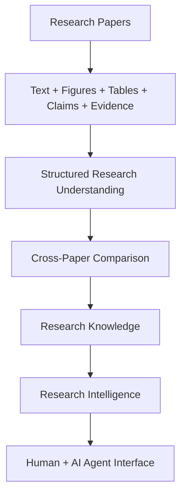
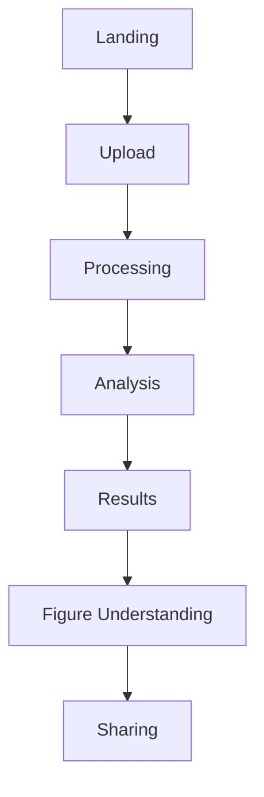
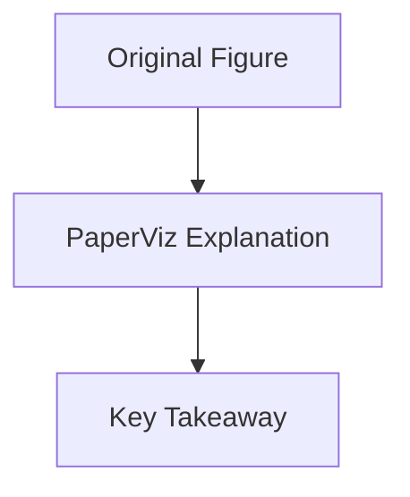
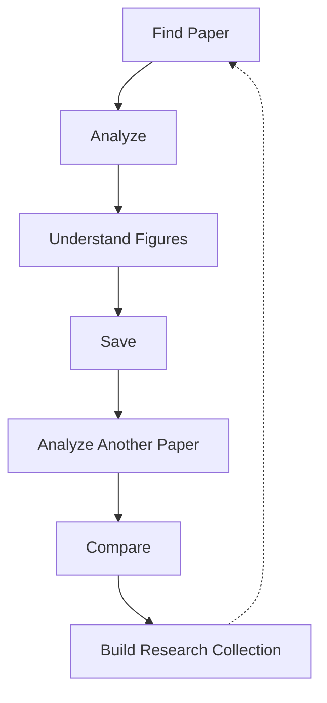
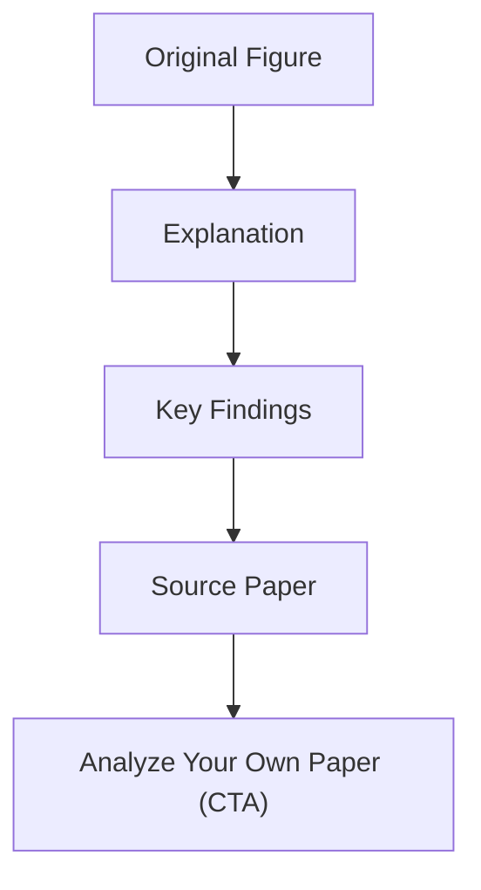
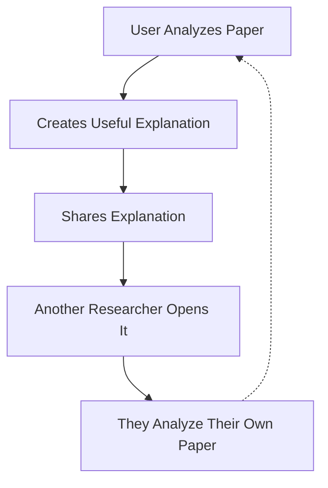
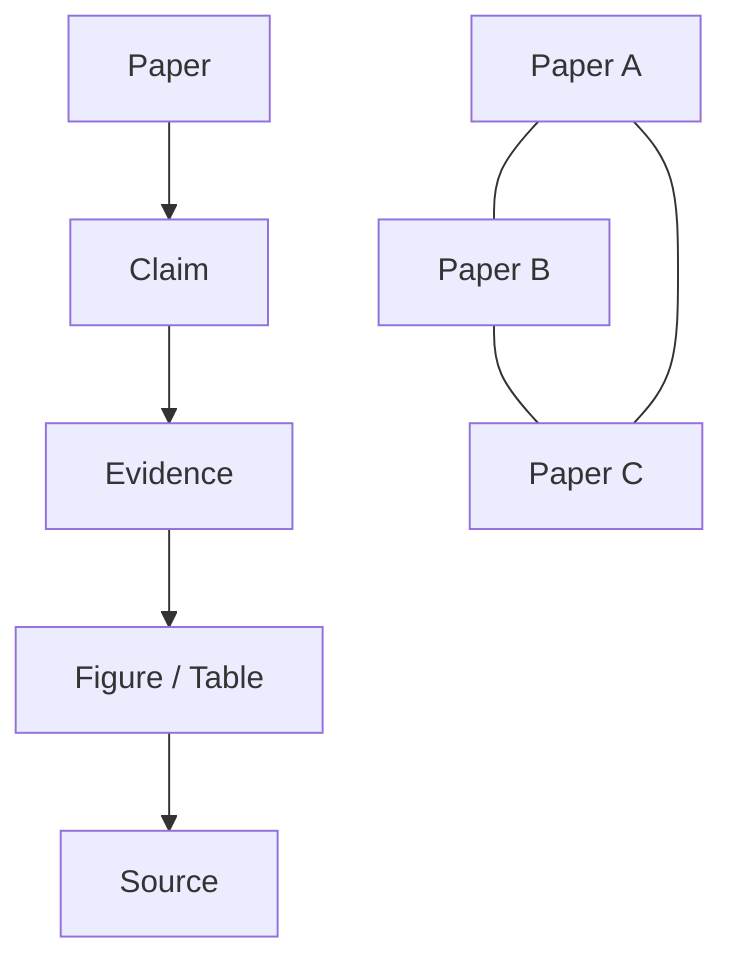
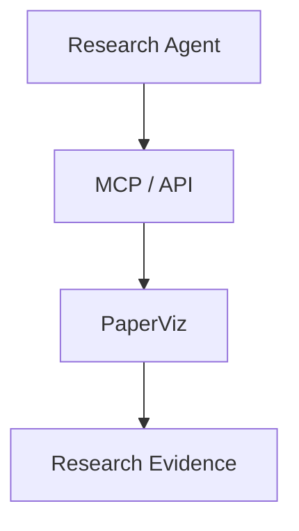
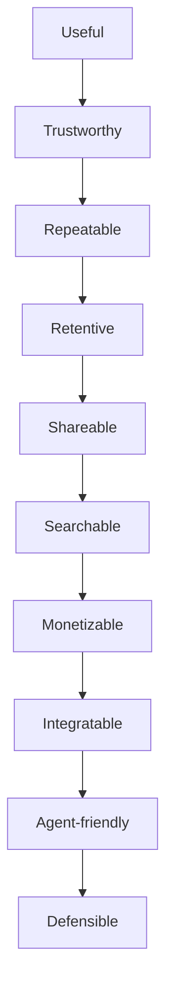

# PaperViz — Agent Roadmap

**Repo:** https://github.com/RizkiRdm/paperviz
**Mission:** Turn PaperViz from a generic AI PDF summarizer into a durable AI Research Evidence Understanding Platform.

---

## 0. How To Use This Document (Read First)

1. Everything in **Section 2 (Global Rules)** is always-on. Apply it to every chunk, every response, no exceptions.
2. Do **not** run ahead and execute the whole roadmap. Work on exactly one chunk at a time — wait until the user names a chunk ID (e.g. "do chunk 1.1").
3. Before touching code: inspect the relevant files in the repo first (Rule 1). Don't assume the repo matches this doc.
4. Implement only what the named chunk asks for. Smallest change that satisfies it (Rule 2).
5. When finished, reply using the **Report Template** in Section 5 — nothing more, nothing less.

**Session setup:** paste Sections 1–5 once at the start of a session/project (positioning + global rules + priority matrix + definition of done + report template). Then, per task, paste just the one chunk block from Section 7.

---

## 1. Product Positioning

Do **not** position PaperViz as:
- Generic AI PDF summarizer
- "Chat with PDF"
- Generic AI research assistant
- Another ChatGPT wrapper

**Target positioning:**
> PaperViz helps researchers understand complex research papers by turning dense text, figures, and results into clear, evidence-linked explanations.

**Long-term direction:**



---

## 2. Global Rules (Always Apply)

**Rule 1 — Inspect Before Editing**
Read the relevant files and understand current routes, services, models, and schema before changing anything. Don't assume the repo matches this doc.

**Rule 2 — Minimal Changes**
Ship the smallest change that satisfies the task. No unrelated rewrites, no new frameworks, no microservices, no Redis/Postgres/vector DB without proven need, no AI features added just because they sound impressive.

**Rule 3 — Product Before Engineering**
Every feature must justify itself through activation, understanding, retention, monetization, distribution, or defensibility. If it doesn't move one of those, don't prioritize it.

**Rule 4 — Preserve Research Integrity**
Never alter the meaning of the source paper. Explanations must carry page number, figure/table number, source text, provenance, and uncertainty. Generated visuals are derived representations, not replacements for the original evidence.

**Rule 5 — Don't Overbuild**
No enterprise billing, complex org management, advanced permissions, multi-model infra, marketplace, agent ecosystem, large vector DB, or distributed/Kubernetes/event-driven architecture. Those belong to later phases.

**Rule 6 — Validate Assumptions**
When implementation depends on something uncertain: state the assumption, explain why it matters, and prefer the smallest implementation that can validate it.

**Rule 7 — No Fake Completion**
Don't call a feature "done" unless it's implemented, tests pass, the build passes, edge cases are considered, and existing functionality still works.

**Rule 8 — Keep Architecture Pragmatic**
Current stack: Go backend, SQLite, React/Vite frontend, Gemini API, PDF processing libs, single-binary deployment. Keep it unless a real requirement forces a change.

---

## 3. Priority Matrix

| Priority | Items |
|---|---|
| **P0 — Critical** | Repo audit · Evidence provenance · Figure explanation quality · Original vs explained figure · Research-oriented summary · Activation measurement · Paper history · Save/reopen workflow |
| **P1 — High** | Multi-paper comparison · Evidence comparison · Shareable figure explanations · Shareable paper explanations · SEO foundation · Usage analytics · Cost measurement |
| **P2 — Medium** | Monetization · API · OpenAPI · Research collections · DOI/URL import · Zotero integration · Browser extension |
| **P3 — Later** | MCP · SDKs · Research knowledge graph · Agent ecosystem · Team collaboration · Advanced integrations |
| **P4 — Do Not Build Yet** | Kubernetes · microservices · complex vector DB · enterprise SSO · complicated permissions · multi-model orchestration · AI marketplace · generic AI chatbot features · gamification · excessive dashboards · dozens of integrations · unnecessary feature variants |

---

## 4. Definition of Done

A chunk is complete only when:

- [ ] Relevant code was inspected
- [ ] Implementation is complete
- [ ] Existing functionality remains intact
- [ ] Tests added/updated where appropriate
- [ ] Build succeeds
- [ ] Lint/type checks pass where applicable
- [ ] Error states are handled
- [ ] Security/privacy implications considered
- [ ] Docs updated if architecture/behavior changed
- [ ] You reported exactly what changed (Section 5 template)

---

## 5. Report Template (use after every chunk)

```
## Completed
- Files changed:
- Features implemented:
- Tests added:
- Key decisions:

## Validation
- Build status:
- Test status:
- Lint status:
- Manual validation performed:

## Risks
- Known limitations:
- Assumptions:
- Unresolved issues:

## Next Chunk
- Recommended: [chunk ID]
```

---

## 6. Chunk Index

| Phase | Chunk | Title |
|---|---|---|
| 0 — Audit | 0.1 | Repository Audit |
| 0 — Audit | 0.2 | Product Flow Audit |
| 1 — Trust & Core Value | 1.1 | Evidence Provenance |
| 1 — Trust & Core Value | 1.2 | Original vs Explained Figure |
| 1 — Trust & Core Value | 1.3 | Figure Explanation Quality |
| 1 — Trust & Core Value | 1.4 | Research-Oriented Summary |
| 2 — Activation & Retention | 2.1 | Paper History |
| 2 — Activation & Retention | 2.2 | Saved Papers |
| 2 — Activation & Retention | 2.3 | Research Collections |
| 2 — Activation & Retention | 2.4 | Return Workflow |
| 3 — Multi-Paper Intelligence | 3.1 | Multi-Paper Comparison Model |
| 3 — Multi-Paper Intelligence | 3.2 | Paper Comparison UI |
| 3 — Multi-Paper Intelligence | 3.3 | Evidence Comparison |
| 4 — Product-Led Distribution | 4.1 | Shareable Figure Explanation |
| 4 — Product-Led Distribution | 4.2 | Shareable Paper Explanation |
| 4 — Product-Led Distribution | 4.3 | Product-Led Referral Loop |
| 5 — SEO Foundation | 5.1 | SEO Architecture |
| 5 — SEO Foundation | 5.2 | Product Pages |
| 5 — SEO Foundation | 5.3 | Programmatic SEO |
| 6 — Monetization | 6.1 | Usage Measurement |
| 6 — Monetization | 6.2 | Usage Limits |
| 6 — Monetization | 6.3 | Cost Model |
| 7 — API & Agent Readiness | 7.1 | Structured Research API |
| 7 — API & Agent Readiness | 7.2 | Machine-Readable Outputs |
| 7 — API & Agent Readiness | 7.3 | OpenAPI |
| 7 — API & Agent Readiness | 7.4 | MCP |
| 8 — Research Knowledge Layer | 8.1 | Structured Research Objects |
| 8 — Research Knowledge Layer | 8.2 | Evidence Graph |
| 8 — Research Knowledge Layer | 8.3 | Cross-Paper Research Map |
| 9 — Growth & Ecosystem | 9.1 | Integrations |
| 9 — Growth & Ecosystem | 9.2 | Developer SDKs |
| 9 — Growth & Ecosystem | 9.3 | Agent Ecosystem |
| 10 — Defensibility | 10.1 | Research Knowledge Accumulation |
| 10 — Defensibility | 10.2 | Workflow Lock-In |
| 11 — AI Resilience | — | Continuous resilience check (not a chunk) |
| 12 — Cleanup | 12.1 | Product Cleanup |

---

## 7. Chunks

### PHASE 0 — Product & Codebase Audit
No behavior changes in this phase. Understand before touching anything.

#### Chunk 0.1 — Repository Audit
**Goal:** Understand the existing PaperViz implementation before making changes.
**Do:**
- Inspect the full repo structure: backend entrypoints, HTTP routes, services, DB models, PDF processing, LLM integration, figure extraction, viz generation, frontend routes/state, upload flow, result rendering, sharing.
- Identify technical debt, incomplete implementations, duplicated logic, architectural risks, and any existing features that already satisfy future roadmap items.
**Constraints:** Do not modify application behavior in this chunk.
**Deliverable:** `docs/product/codebase-audit.md` — current architecture, existing capabilities, missing capabilities, technical risks, product risks, recommended changes, changes to avoid.

#### Chunk 0.2 — Product Flow Audit
**Goal:** Map the current user journey.



**Do:** Determine where activation occurs, where users receive value, where users likely abandon, the current "aha moment," and what PaperViz already does better than generic PDF chat.
**Constraints:** No implementation yet.
**Deliverable:** `docs/product/current-user-flow.md`

---

### PHASE 1 — Trust & Core Value
Highest priority. The product must become genuinely useful before adding growth machinery.

#### Chunk 1.1 — Evidence Provenance
**Goal:** Make every AI-generated explanation traceable to the original paper.
**Do:** Design a reusable Evidence model with: `paper_id`, `page`, `figure_id`, `table_id`, `section`, `source_text`, `source_reference`.
**Constraints:** Don't over-engineer the schema.
**Deliverable:** Backend implementation + frontend display + tests.

#### Chunk 1.2 — Original vs Explained Figure
**Goal:** Users clearly understand original evidence vs. generated interpretation.



**Do:** Preserve the original figure, display the explanation alongside it, clearly distinguish generated interpretation from original evidence, show provenance.
**Constraints:** No unnecessary animations, no misleading visual transformations.

#### Chunk 1.3 — Figure Explanation Quality
**Goal:** Improve prompts and processing specifically for figures.
**Do:** Identify (when possible) chart type, axes, groups, trends, comparisons, notable differences, uncertainty/error bars, statistical significance, limitations, key takeaway.
**Constraints:** Never invent information not visible or supported by the paper. If confidence is low, state that the figure cannot be reliably interpreted — don't force an answer.

#### Chunk 1.4 — Research-Oriented Summary
**Goal:** Replace generic summarization with structured research understanding.
**Do:** Cover Research Question, Method, Main Findings, Evidence, Limitations, Key Figures, Key Tables, Conclusion.
**Constraints:** Keep the UI concise — not a giant academic dashboard.

---

### PHASE 2 — Activation & Retention
Goal: determine whether users return to PaperViz.

#### Chunk 2.1 — Paper History
**Do:** List previously analyzed papers — title, date, status, summary, figures, explanations.
**Constraints:** Use the existing DB. No new database technology.

#### Chunk 2.2 — Saved Papers
**Do:** Save, rename, delete, reopen.
**Constraints:** Avoid complex folders initially.

#### Chunk 2.3 — Research Collections
**Prerequisite:** Chunks 2.1 and 2.2 working.
**Do:** Allow grouping papers into simple named collections.
**Constraints:** Keep intentionally simple (no nested structures).

#### Chunk 2.4 — Return Workflow
**Goal:** Design a reason for users to come back.



**Constraints:** No gamification, no artificial streaks, no notification spam.

---

### PHASE 3 — Multi-Paper Intelligence
Strategically important: PaperViz should become more valuable than a single-paper summarizer.

#### Chunk 3.1 — Multi-Paper Comparison Model
**Do:** Design a comparison data model covering research question, methodology, dataset, sample, findings, limitations, figures, evidence, conclusions.
**Constraints:** No knowledge graph yet — establish the structured comparison model first.

#### Chunk 3.2 — Paper Comparison UI
**Do:** Implement Paper A vs. Paper B vs. Paper C. Users should quickly see what agrees, what disagrees, methodological differences, evidence differences, limitations. Every generated claim links back to source papers.

#### Chunk 3.3 — Evidence Comparison
**Do:** Structured claim → per-paper evidence view (supporting or contradicting), e.g. Claim "Method X improves outcome Y" → Paper A: supporting, Paper B: supporting, Paper C: contradicting.
**Note:** More strategically important than adding generic AI chat.

---

### PHASE 4 — Product-Led Distribution
No paid ads. Build distribution into the product itself.

#### Chunk 4.1 — Shareable Figure Explanation
**Goal:** Public share pages for individual figures.



**Do:** Unique public URL, privacy controls, expiration support where appropriate, clear source attribution, CTA to analyze another paper.

#### Chunk 4.2 — Shareable Paper Explanation
**Do:** Support public / unlisted / private visibility.
**Constraints:** No complicated permission system.

#### Chunk 4.3 — Product-Led Referral Loop



**Constraints:** The share page must be useful even without signup. No aggressive referral mechanics.

---

### PHASE 5 — SEO Foundation
Based on real product output, not mass-produced AI articles.

#### Chunk 5.1 — SEO Architecture
**Do:** Design the information architecture. Candidate routes:
- `/research-paper-summarizer`
- `/figure-explanation`
- `/scientific-figure-analysis`
- `/research-paper-analysis`
- `/compare-research-papers`
- `/explain/`

**Constraints:** Only create pages with genuine user value.

#### Chunk 5.2 — Product Pages
**Do:** High-intent landing pages for: research paper summarization, scientific figure explanation, research paper analysis, chart interpretation, academic paper understanding. Each page covers problem, solution, workflow, examples, limitations, CTA.
**Constraints:** No generic SEO filler.

#### Chunk 5.3 — Programmatic SEO
**Do:** First identify safe programmatic page types — candidates: `/explain/scientific-figure`, `/research-paper/[paper-id]`, `/figure/[figure-id]`. Only index pages with substantial, useful, original content.
**Constraints:** Do not immediately generate thousands of pages. Avoid low-quality AI-generated page spam.

---

### PHASE 6 — Monetization
Only after validating repeated usage.

#### Chunk 6.1 — Usage Measurement
**Do:** Track papers analyzed, figures analyzed, processing time, returning users, papers per user, share events, comparison events, successful analysis rate.
**Constraints:** Do not collect unnecessary personal data.

#### Chunk 6.2 — Usage Limits
**Do:** Design usage-based tiers — Free (limited papers/month, basic analysis), Pro (more papers, advanced figure analysis, saved library, comparison), Research (high usage, advanced workflows, export).
**Constraints:** Do not hard-code pricing before usage economics are understood.

#### Chunk 6.3 — Cost Model
**Do:** Estimate LLM cost, PDF processing cost, storage, bandwidth, infra, support. Calculate approximate cost per paper, gross margin, maximum free-tier abuse.
**Constraints:** Do not optimize infrastructure prematurely.

---

### PHASE 7 — API & Agent Readiness
Prepare PaperViz for the AI ecosystem. Do not build a giant agent platform.

#### Chunk 7.1 — Structured Research API
**Do:** Expose clean API concepts — `POST /papers`, `GET /papers/{id}`, `GET /papers/{id}/summary`, `GET /papers/{id}/figures`, `GET /papers/{id}/tables`, `GET /papers/{id}/claims`, `POST /papers/{id}/compare`.
**Constraints:** Follow existing architecture/conventions — don't blindly copy these routes if the current API already uses a better convention.

#### Chunk 7.2 — Machine-Readable Outputs
**Do:** Every important result gets structured JSON (paper, summary, claims, figures, tables, evidence). Document the schema.
**Constraints:** Avoid returning only presentation-oriented text.

#### Chunk 7.3 — OpenAPI
**Do:** Create an OpenAPI spec — authentication, errors, request/response schemas, rate limits, stable identifiers.
**Constraints:** Keep it versioned.

#### Chunk 7.4 — MCP
**Prerequisite:** API is stable.
**Do:** Expose high-value operations: `analyze_paper`, `get_summary`, `get_figures`, `get_evidence`, `compare_papers`, `search_papers`.
**Constraints:** Don't expose dozens of unnecessary tools.

---

### PHASE 8 — Research Knowledge Layer
Beginning of the long-term moat.

#### Chunk 8.1 — Structured Research Objects
**Do:** Formalize: Paper, Claim, Evidence, Figure, Table, Method, Result, Citation — each with stable identifiers.

#### Chunk 8.2 — Evidence Graph



**Constraints:** No graph database yet. Use the simplest architecture that works.

#### Chunk 8.3 — Cross-Paper Research Map
**Do:** Allow users to understand supporting papers, contradictory papers, similar methodologies, different datasets, different findings.
**Note:** This is the foundation of the long-term product.

---

### PHASE 9 — Growth & Ecosystem
**Prerequisite:** Activation and retention show positive signals.

#### Chunk 9.1 — Integrations
**Candidates:** Zotero, browser extension, DOI import, URL import, cloud storage, citation managers.
**Constraints:** Prioritize by actual user demand. Don't build every integration.

#### Chunk 9.2 — Developer SDKs
**Prerequisite:** API usage is validated.
**Do:** Python SDK, TypeScript SDK, CLI. Prioritize Python first if research users are the primary audience.

#### Chunk 9.3 — Agent Ecosystem



**Candidates:** Agent authentication, fine-grained permissions, idempotent operations, async analysis jobs, webhooks, event notifications.
**Constraints:** Only build these when actual agent usage requires them.

---

### PHASE 10 — Defensibility
Lowest implementation priority, highest long-term strategic priority. Goal is accumulated value, not feature count.

#### Chunk 10.1 — Research Knowledge Accumulation
**Do:** Determine what structured info can legitimately become accumulated value — paper relationships, user-created annotations, evidence mappings, comparisons, research collections, structured figure explanations.
**Constraints:** Respect copyright, privacy, licensing, and user ownership. Do not treat uploaded papers as proprietary training data without explicit legal/user permission.

#### Chunk 10.2 — Workflow Lock-In
**Do:** Identify legitimate switching costs — saved collections, annotations, evidence mappings, comparisons, projects, integrations.
**Constraints:** No artificial lock-in. Make the product valuable enough that users voluntarily stay.

---

### PHASE 11 — AI Resilience (continuous check, not a chunk)

Continuously evaluate: *"If ChatGPT, Claude, Gemini, or an open-source agent can reproduce 90% of this feature, why does PaperViz still exist?"*

The answer must increasingly be: not better summarization, but that PaperViz owns the research workflow, structured evidence, cross-paper relationships, visual understanding, and machine-readable research infrastructure.

---

### PHASE 12 — Product Cleanup
**Prerequisite:** Strategic features validated.

#### Chunk 12.1 — Product Cleanup
**Do (remove):** Redundant features, unused components, dead code, unnecessary dependencies, confusing UI, duplicated workflows, low-value AI features.
**Do (optimize):** Performance, accessibility, error handling, loading states, mobile usability, security, observability.
**Constraints:** Do not optimize prematurely — this phase only.

---

## 8. Final Product Principle



Do not reverse this order:
- Don't build the ecosystem before proving the product.
- Don't build the moat before proving the workflow.
- Don't build monetization complexity before proving willingness to pay.
- Don't build AI-agent infrastructure before a stable product/API foundation exists.

**Immediate objective:** make PaperViz significantly better at helping a researcher understand evidence in a paper — especially figures, tables, claims, and results. Everything else comes after that.
