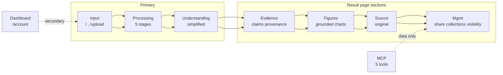

# PaperViz — Canonical Flow (P02)

Date: 2026-09-14
Plan: `.omo/plans/paperviz_master_refactor_plan.md` §2 (no redesign)
Inventory: `docs/Task Agent/P01_inventory.md`
Status: definition only. No UI or API edits in P02.

---

## Deps invariants

- `UI → API → App → Domain/Services → Repo/Infra` — no reverse edges. Handlers transport only.
- `User Model → MCP → App/Data` — MCP data/tools only, no reasoning, no hidden Gemini.

---

## 1. Canonical flow

Single primary journey. Secondary surfaces contained, not dominant.

### Stages — 1-line purpose each

| # | Stage | Purpose |
|---|---|---|
| 1 | Input | Capture paper: PDF, pasted text, DOI, URL. Single form, explicit `source_type`. |
| 2 | Processing | Show progress: reading doc, extracting structure, preparing evidence, rebuilding figures, completing. |
| 3 | Understanding | Plain-language summary at chosen level. |
| 4 | Evidence | Claims with source text, page, section, figure/table refs, provenance. |
| 5 | Figures | Re-visualized charts with grounding badge verified/partial/unsupported/failed. |
| 6 | Source | Original text and metadata, collapsible. |
| 7 | Mgmt | Share, collections, visibility. Secondary actions on Result. |

Processing maps pipeline `OnStage` simplifying/verifying/generating_charts to 5 user labels. Implementation details hidden.

Result page holds stages 3-7 as sections on one page (`/:documentId`). Not separate routes.

---

## 2. Screen ranking

| Rank | Screens | Role | Routes |
|---|---|---|---|
| Primary | Input, Processing, Result | Core loop. Must be obvious, fast, coherent. | `/`, `/:documentId` |
| Secondary | Dashboard, Collections, Compare, Share public view | Recent docs, search, resume work. Support, not center. | `/account`, `/share/doc/:token`, `/share/fig/:token`, compare in-app only |
| Tertiary | MCP surface | Agent data access. 5 deterministic tools. | `internal/mcp` — no UI route except `/agents` docs |
| Supporting | Auth, NotFound | Entry guard, error boundary. | `/login`, `/signup`, `*` |

Tertiary never dominates primary. Secondary copy and nav weight stays secondary (P51 gate).

---

## 3. Route → stage mapping

### Frontend `frontend/src/App.jsx` — 9 routes

| Route | Component | File | Stage |
|---|---|---|---|
| `/` | `UploadPage` | `frontend/src/pages/upload-page.jsx` (43 LOC) | Input |
| `/login` | `LoginPage` | `frontend/src/pages/login-page.jsx` (112 LOC) | Supporting |
| `/signup` | `SignupPage` | `frontend/src/pages/signup-page.jsx` (112 LOC) | Supporting |
| `/account` | `AccountPage` | `frontend/src/pages/account-page.jsx` (162 LOC) | Mgmt secondary |
| `/agents` | `AgentsPage` | `frontend/src/pages/agents-page.jsx` (167 LOC) | Tertiary docs |
| `/share/fig/:shareToken` | `ShareFigurePage` | `frontend/src/pages/share-figure-page.jsx` (151 LOC) | Mgmt secondary — public figure |
| `/share/doc/:shareToken` | `SharePaperPage` | `frontend/src/pages/share-paper-page.jsx` (231 LOC) | Mgmt secondary — public doc |
| `/:documentId` | `ResultPage` | `frontend/src/pages/result-page.jsx` (743 LOC GOD) | Processing + Understanding + Evidence + Figures + Source + Mgmt |
| `*` | `NotFoundPage` | `frontend/src/pages/not-found-page.jsx` (19 LOC) | Supporting |

Note: `/upload` alias referenced in plan §2 as canonical Input entry. Not registered in `App.jsx` current. `/` serves Input. Dup entry consolidation deferred to P03.

Dead refs still present (P01 §7): `result-page.jsx:305,724` → `/dashboard`, `upgrade-cta.jsx:16` → `/pricing`. Routes not registered. 404 via `spaNotFound`. Fix in P03.

### Backend `internal/handlers/router.go` (182 LOC)

| API prefix | Handler | Stage |
|---|---|---|
| `POST /api/documents` | `DocumentHandler.Create` | Input ingestion |
| `GET /api/documents/:id` (+ charts, claims, tables, methods, results, citations, evidence-graph, research-map) | `DocumentHandler.*` | Result read-model |
| `POST /api/documents/compare` | `DocumentHandler.Compare` | Compare — in-app only |
| `POST /api/import/doi`, `POST /api/import/url` | `ImportHandler` | Input — DOI/URL |
| `GET /share/doc/:token`, `GET /share/fig/:token` | `ShareHandler` | Mgmt public view |
| `POST /api/documents/:id/share`, `POST /api/documents/:id/charts/:chartId/share` | `ShareHandler` | Mgmt share creation |
| `GET /api/collections`, `POST /api/collections` etc | `CollectionHandler` | Mgmt secondary |
| `GET /api/documents/:id/annotations` etc | `AnnotationHandler` | Mgmt within Result |
| `POST /api/auth/signup`, `/login`, `/google/*` | `AuthHandler` | Supporting |
| `GET /api/account/summary`, `GET /api/usage` | `AccountHandler`, `UsageHandler` | Mgmt secondary |
| `*` unmatched | `spaNotFound` | Supporting — API 404 JSON, SPA fallback |

---

## 4. Assumptions

- Scope read-only doc. No route, handler, or component edits. Single file deliverable.
- LOC from `P01_inventory.md` 2026-09-14, `wc -l` incl comments. 200 LOC flag, 250 hard gate (P54).
- Handler→repo coupling = literal `New.*Repo` in `handlers/*.go` (43 hits, documents.go 33). Transitive edges via `graphify path` pending P09.
- Dead routes = string match `/dashboard` `/pricing` `/compare` `/explain` in `frontend/src` after 11.5 cuts. Dynamic construction not covered.
- MCP tool count = `grep -c "Name:" internal/mcp/tools.go` — current 6, target 5. P02 does not change count.
- `time.Sleep` in `pipeline.go:74,108` stays until P14. Processing stage labels centralized in P06.
- `/upload` consolidation, dead-link removal, redirect matrix deferred to P03. This doc records intended flow, not current routing correctness.
- Verification baseline: `go test ./...` 422 passed, `go vet` clean, `gofmt -l .` empty per P01. No new tests in P02.

---

## 5. Out of scope

No redesign in P02. No JSX edits, no Go edits, no route registration changes, no token or style invention, no infra added. Definition only. Design tokens (`DESIGN.md` Dub) not applied here. UX rebuild in P04-P06, routing fixes in P03.

---

## 6. Constraints honored

- Inspect only: `App.jsx`, `router.go`, `pages/*.jsx` existence, `P01_inventory.md`, plan §0/§2.
- No scan of `.gitignore` or unrelated docs.
- No new abstractions, no ORM, queue, or broker.

---

Verified: `frontend/src/App.jsx` 36L, `internal/handlers/router.go` 182L, `frontend/src/pages/*.jsx` 9 files, `P01_inventory.md` 372L, plan §0/§2 read. File exists. No UI code changes.
