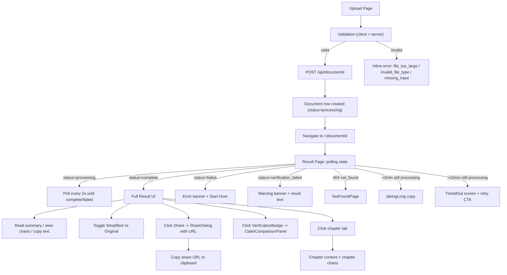

# PaperViz — Current User Flow Audit (Chunk 0.2)

**Date:** 2026-08-12
**Phase:** 0 — Audit
**Status:** No behavior changes. Mapping only.

---

## 1. User Journey Map

---

## 2. Step-by-Step Breakdown

### Stage 1: Landing / Upload (`UploadPage`)
- **Entry:** `GET /` → `UploadPage` (`frontend/src/pages/upload-page.jsx`)
- **Trust signals:** Top pill tag "Ephemeral 7-Day Storage", pill tags "Plain Language", "Re-visualized Charts", "Claim Verification".
- **Inputs:** `UploadDropzone` (PDF file, drag-drop, click, 20MB cap, `application/pdf` only) or paste raw text (textarea).
- **Reading level:** `simplified` (default) or `eli5` via `ReadingLevelSelector`.
- **Validation (client):**
  - File > 20MB → `ERROR_MESSAGES.file_too_large`
  - File type ≠ PDF → `ERROR_MESSAGES.invalid_file_type`
  - No file AND no text → `ERROR_MESSAGES.missing_input`
- **Submit:** `createDocument()` → `POST /api/documents` (multipart form). On success → `navigate("/" + result.document_id)`.

### Stage 2: Backend Intake (`POST /api/documents`)
- **Endpoint:** `internal/handlers/documents.go` `DocumentHandler.Create`.
- **Validation (server):** Size cap `maxUploadBytes = 20MB` enforced before buffering. PDF magic bytes check. Reading-level whitelist. Exactly one of (file, text).
- **Transaction:** Document row inserted with `status=processing`, `processing_stage=""`.
- **Pipeline kickoff:** Background goroutine runs `services.RunPipeline` with `OnStage` callback persisting stage transitions.

### Stage 3: Pipeline (`services.RunPipeline`)
Three sequential Gemini stages + chart sub-pipeline:

| Stage | Constant | Failure Mode | Status Set |
|---|---|---|---|
| Simplify | `stage("simplifying")` | Gemini timeout/retry exhaustion | `failed` (`simplification_failed`) |
| Verify (claim diff) | `stage("verifying")` | Gemini timeout/retry | `failed` (`verification_failed_to_run`) |
| Verify mismatch | (post-verify check) | `MismatchDetected=true` | `verification_failed` (still returns text) |
| Chart (chapter-based) | `stage("generating_charts")` | `DetectChapters` failure | continues, sets `ChartExtractionDegraded=true` |
| Chart (image-fallback) | (PDF only) | `ParsePDF` failure | logs error, continues |

**Rate-limit handling:** `time.Sleep(3 * time.Second)` between Gemini-heavy stages to respect free-tier limits.

### Stage 4: Result Page Polling (`ResultPage` + `useDocumentPoll` hook)
- **Entry:** `useParams().documentId` → `useDocumentPoll(documentId)` hook (`frontend/src/hooks/use-document-poll.js`).
- **Polling contract:** `getDocument()` every 2s while `status === "processing"`. Soft warn at 2min, hard timeout at 10min.
- **Hook state returned:** `{ doc, error, notFound, timedOut, takingLong, retry }`.
- **Processing UI:** Spinner + `processing_stage` label (`simplifying` → "Simplifying language...", `verifying` → "Checking accuracy...", `generating_charts` → "Generating visualizations...").

### Stage 5: Result Content (when `status=complete`)
- **Tabs (chapter):** When `doc.chapters.length > 1` → horizontal tablist. Active chapter's content + chapter-filtered charts.
- **No-chapter mode:** Single article block, all charts below, empty states for `chart_extraction_degraded` or "no charts detected".
- **Reading level badge:** "Simplified" / "ELI5" pill.
- **Original toggle:** Switch between `simplified_text` and `original_text` (the latter being the full extracted PDF/text).
- **Charts:** `ChartCard` per chart; image fallback shows annotation (image-serving endpoint missing — known issue).

### Stage 6: Trust Features
- **`VerificationBadge`:** Visible only on `status=complete`. Click → toggles `ClaimComparisonPanel` (shows claim diff vs original).
- **`WarningBanner`:** Visible when `status=verification_failed`.

### Stage 7: Sharing
- **`Share` button** → `ShareDialog` modal with current `window.location.href`.
- **Copy to clipboard** with 2s visual feedback (`Check` icon).
- **Fallback:** If clipboard API fails, select input + show orange fallback message.
- **Expiration note:** "Link expires after 7 days of inactivity" (per backend expiry logic).

---

## 3. Where Value Is Delivered (Activation)

### Current "Aha Moments"
1. **First sentence of plain-language summary** (`Simplified & Verifying...` → "Here is your summary"). Primary activation point.
2. **Verification badge appears** — trust signal that PaperViz actually checked claims.
3. **Chapter tabs** — user discovers the paper is navigable beyond a wall of text.
4. **Share button works** — passive distribution lever. Currently the link is the page URL (no signed token), so it expires via DB row TTL only.

### Trust Reinforcement
- `processing_stage` labels show internal pipeline state — user sees "Gemini is doing real work" not just a spinner.
- `verification_failed` is **distinct** from `failed` — user still gets the simplified text plus a warning. Preserves value.
- `chart_extraction_degraded` doesn't block summary — partial value preserved.

---

## 4. Where Users Likely Abandon

| Stage | Friction | Severity | Reason |
|---|---|---|---|
| Upload | 20MB cap, text-only PDFs (no OCR fallback) | High | Scanned PDFs silently fail with `extraction_failed` (PDF library returns no text layer). UX: vague "image-only or corrupted" message. |
| Wait | Pipeline routinely >2min on real papers | Medium | Mitigated by `takingLong` copy, but no progress percentage. |
| Wait | No cancel/back button during processing | Medium | User must wait or close tab. No way to abort. |
| Result | Verification mismatch warning | Medium | "Verification issue" wording is vague — user doesn't know if summary is wrong. |
| Share | Page-URL share contains document ID in path, not a signed share token | Medium | Anyone with the ID can view. No way to make private. |
| Return | No history, no saved papers | **Critical** | Once user closes the tab, document is unreachable (ephemeral 7-day TTL). Zero retention loop. |

---

## 5. What PaperViz Already Does Better Than Generic PDF Chat

1. **Claim verification** (Gemini cross-checks simplified text against original) — rare in consumer-grade PDF tools.
2. **Plain-language summaries at chosen reading level** (`simplified` vs `eli5`) — explicit user control.
3. **Re-visualized charts** (chapter-based generation + image-fallback for embedded charts) — visual layer, not text-only.
4. **7-day ephemeral storage** — privacy-friendly by default (no accounts required for ephemeral use).
5. **Stage-by-stage transparency** — user sees `simplifying → verifying → generating_charts`, not a black box.

---

## 6. Missing From Current Flow (Roadmap Gap)

| Missing | Roadmap Chunk | P-Level |
|---|---|---|
| Saved papers (return to past analyses) | 2.1, 2.2 | P0 |
| Evidence provenance (page numbers, source text) | 1.1 | P0 |
| Original vs explained figure (side-by-side) | 1.2 | P0 |
| Figure explanation quality (axes, trends, uncertainty) | 1.3 | P0 |
| Research-oriented summary structure | 1.4 | P0 |
| Activation measurement (analytics) | 6.1 | P1 |
| Multi-paper comparison | 3.1–3.3 | P1 |
| Shareable figure explanations (per-figure public URL) | 4.1 | P1 |
| Privacy controls on share links (public/unlisted/private) | 4.2 | P1 |

---

## 7. Recommendations (Order of Operations)

Per `docs/paperviz-agent-roadmap.md` Section 8 final principle: **Useful → Trustworthy → Repeatable → Retentive → Shareable**.

1. **Phase 1 (Trust & Core Value) — Highest priority.** The summary is already useful but lacks provenance and figure-level depth. Without provenance, the verification badge is unfalsifiable.
2. **Phase 2 (Activation & Retention) before Phase 4 (Distribution).** Currently no return loop — promoting a one-shot tool burns acquisition spend. Fix retention first.
3. **Auth flow exists but is invisible.** Dashboard route works, but never surfaced in UploadPage's main nav. Users don't know they have a "library" feature.
4. **Share link is leaky.** Path-based document ID + session cookie for auth. Need signed share tokens or visibility controls before public-facing share.

---

## 8. Constraints Honored

- ✅ No implementation changes.
- ✅ No modifications to behavior.
- ✅ Inspect-only of frontend pages, pipeline services, auth handler, API endpoints.
- ✅ Out-of-scope files (config, secrets, design docs, audit scripts) not touched.

---

## 9. Audit Conclusion

PaperViz's current flow delivers **value on first try** (summary, charts, verification) but has **zero retention loop** (no history, no saved papers, no return trigger). Phase 1 (trust) and Phase 2 (retention) are the correct next priorities; everything else (comparison, distribution, monetization) is downstream.

End of audit.