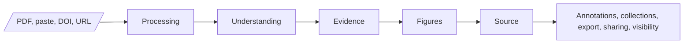
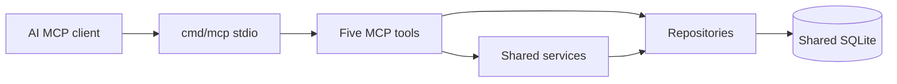

# PaperViz Current User Flow

> Current product-flow contract, source-verified on 2026-09-25. When this document conflicts with `frontend/src/App.jsx`, `internal/handlers/router.go`, or current service behavior, code wins and this document must be updated.

## Canonical Web Journey

### Stage purposes

| Stage | User goal | Current implementation |
|---|---|---|
| Input | Choose a paper source and reading level | Unified form with PDF, paste, DOI, and URL tabs |
| Processing | Know whether work is progressing | Two-second polling, five user-facing stage labels, long-running warning, timeout, retry |
| Understanding | Read a simplified explanation | Simplified or ELI5 output |
| Evidence | Check claims against source context | Claims, evidence, comparisons, and structured research objects |
| Figures | Understand numeric findings | Grounded charts, provenance, annotations, and unsupported states |
| Source | Return to original material | Original text and source metadata |
| Management | Retain or share useful context | Annotations, collections, export, visibility, and share links |

Processing, Understanding, Evidence, Figures, Source, and Management share one result route: `/:documentId`.

## User-facing processing labels

Internal pipeline stages are mapped to five stable labels:

1. Reading paper
2. Extracting structure
3. Preparing evidence
4. Rebuilding figures
5. Completing

Users should not need to understand Gemini prompts, repository transactions, or evidence-extraction implementation to follow progress.

## Primary Web Flow

1. Person opens `/`.
2. Person chooses PDF, pasted text, DOI, or URL.
3. Person selects `Simplified` or `eli5` when applicable.
4. Frontend calls `POST /api/documents/` or matching import endpoint.
5. Backend validates input, inserts a processing document, and starts the asynchronous pipeline.
6. Frontend navigates to `/:documentId`.
7. Frontend polls the document until terminal state.
8. Result page renders understanding, evidence, figures, source, and management sections.
9. Person can inspect, annotate, organize, export, or share according to ownership and visibility rules.

### Failure behavior

- Input errors appear inline and preserve the current input for retry.
- Rate limits and network failures receive user-facing messages.
- Long processing produces a soft warning; ten-minute polling timeout exposes retry.
- Verification mismatch detail remains visible.
- One failed figure does not invalidate unrelated document output.
- Unsupported grounded data is not rendered as trustworthy chart data.

## Agent Flow

### Intended product direction

A person authenticates, obtains an API key, configures an AI client, and uses PaperViz MCP to retrieve structured research data.

### Implemented local MCP flow

Available operations:

- deterministic pasted-text intake;
- global title search;
- selective document retrieval;
- figure and provenance retrieval;
- evidence and claim retrieval.

### Agent-flow gap

MCP ingestion does not start simplification, verification, or figure generation. A document created only through MCP can remain in `processing` state. The `/agents` page also generates a remote `/api/mcp` configuration that is not registered by the current HTTP router.

The local stdio server is implemented. The full remote agent-first journey is not yet end-to-end complete.

## Screen Ranking

| Priority | Surface | Route or runtime | Role |
|---|---|---|---|
| Primary web | Input | `/` | Manual paper ingestion |
| Primary web | Processing and result | `/:documentId` | Full paper-understanding journey |
| Supporting web | Account | `/account` | API key, usage, subscription, account context |
| Supporting web | Authentication | `/login`, `/signup` | Session entry |
| Supporting web | Agent setup | `/agents` | Generated client configuration; remote transport currently mismatched |
| Secondary web | Public sharing | `/share/doc/:shareToken`, `/share/fig/:shareToken` | Expiring shared research views |
| Agent runtime | MCP | `cmd/mcp` over stdio | Deterministic data access |
| Supporting | Not found | `*` | Error boundary |

Account and auth surfaces support the product but must not replace input and result as the dominant web journey.

## Frontend Route Inventory

Source: `frontend/src/App.jsx`.

| Route | Component | Purpose |
|---|---|---|
| `/` | `UploadPage` | PDF, paste, DOI, and URL input |
| `/upload` | Redirect | Compatibility redirect to `/` |
| `/dashboard` | Redirect | Compatibility redirect to `/account` |
| `/login` | `LoginPage` | Login |
| `/signup` | `SignupPage` | Signup |
| `/account` | `AccountPage` | Account, API key, usage, billing |
| `/agents` | `AgentsPage` | MCP client configuration |
| `/share/fig/:shareToken` | `ShareFigurePage` | Public figure |
| `/share/doc/:shareToken` | `SharePaperPage` | Public paper |
| `/:documentId` | `ResultPage` | Processing and complete result |
| `*` | `NotFoundPage` | Not found |

Static files under `frontend/public/` may include pages no longer registered in React. They are not canonical routes.

## Backend Flow Grouping

Source: `internal/handlers/router.go`.

| Flow group | Representative operations |
|---|---|
| Health | `GET /healthz` |
| Input | `POST /api/documents/`, `POST /api/import/doi`, `POST /api/import/url` |
| Processing result | `GET /api/documents/:id` |
| Research objects | claims, tables, methods, results, citations, evidence graph, research map |
| Figures | chart image and structured figure data |
| User management | title, save, delete, list, stats |
| Research context | annotations, collections, export |
| Sharing | document/figure token generation, revocation, visibility, public views |
| Identity | signup, login, logout, session, Google OAuth, API key |
| Billing | checkout, portal, webhook |
| Usage and analytics | usage, account analytics, referral and upgrade events |

See [`../codebase-reference.md`](../codebase-reference.md) for the full route table.

## Management Rules

- Document lists, saved state, deletion, annotations, collections, sharing, and visibility require authenticated ownership where implemented.
- Public shared payloads exclude private source material and user identifiers.
- Export excludes original and simplified full text.
- MCP does not expose these user-owned management operations.
- Public share responses carry `noindex, nofollow` headers.

## Current Flow Gaps

| Gap | User or maintainer impact |
|---|---|
| MCP text intake does not start processing | Agent-only ingestion cannot produce simplified output |
| `/agents` points to absent remote transport | Generated setup cannot complete against current server |
| MCP search is global | Results are not scoped to a signed-in user's library |
| Public static SEO artifacts lag route cuts | Search and screenshot surfaces can show removed product areas |
| Single SQLite connection | Limits concurrent agent and browser traffic |

## Invariants

- `frontend/src/App.jsx` is the frontend route source of truth.
- `internal/handlers/router.go` is the REST route source of truth.
- `internal/mcp/tools.go` is the MCP tool source of truth.
- The result page remains one route, not five disconnected section routes.
- Verification and grounding states remain visible.
- Human management operations do not become MCP tools without explicit product approval.
